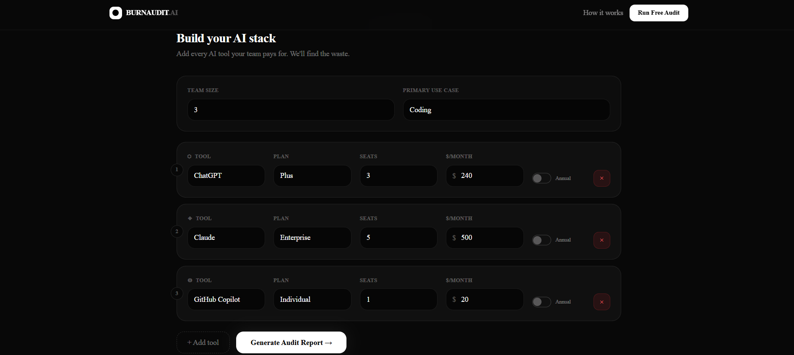
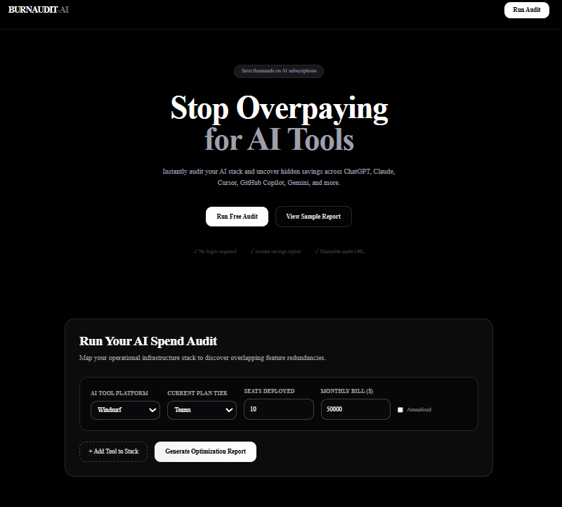
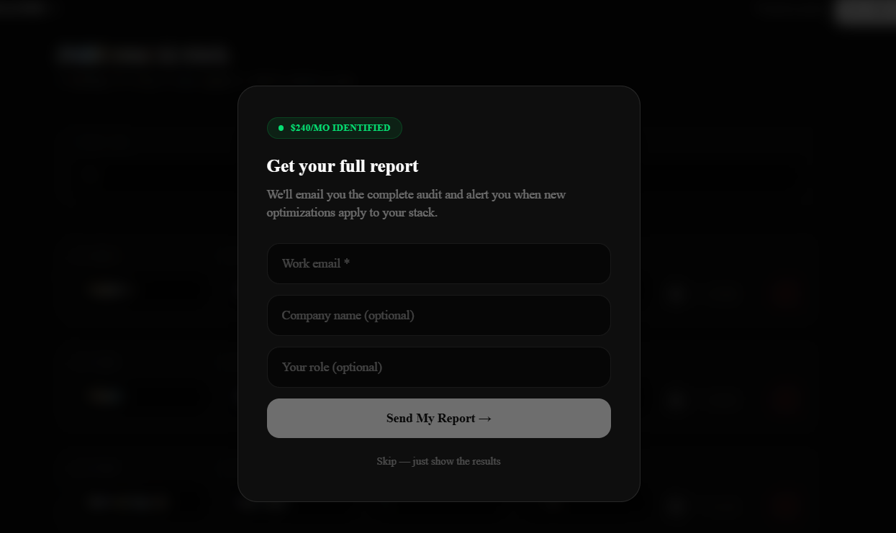
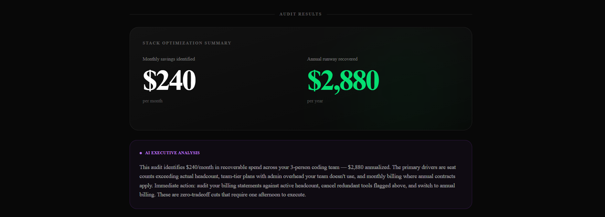
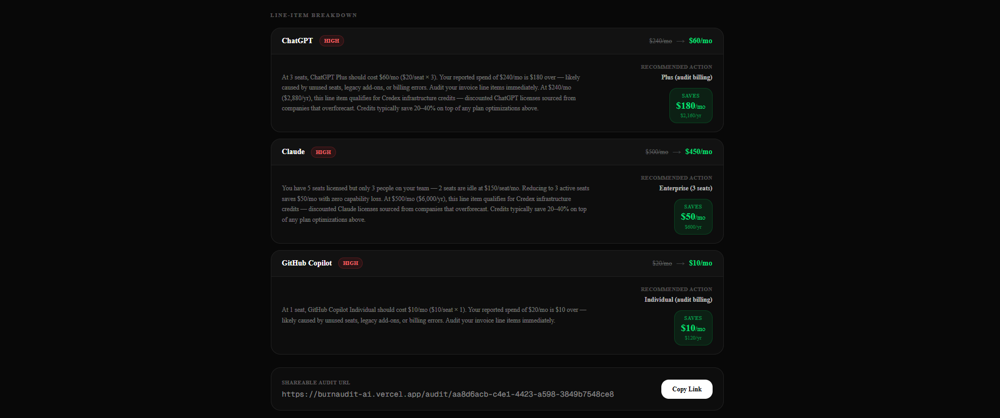

# BurnAudit AI

Free AI spend auditing tool for startup founders and engineering managers. Input your AI tools, plans, and team size — get an instant breakdown of where you're overspending, what to switch or downgrade, and your total monthly and annual savings.


**[Live Demo →](https://burnaudit-ai.vercel.app)**

---
## Quick Start

```bash
# Clone
git clone https://github.com/DhanyaSharma/burnaudit-ai
cd burnaudit-ai

# Install
npm install

# Set up environment variables
cp .env.example .env.local
# Fill in your keys (see Environment Variables section)

# Run locally
npm run dev
# Open http://localhost:3000
```

### Environment Variables

```bash
GEMINI_API_KEY=               # Gemini API key for AI summaries
NEXT_PUBLIC_SUPABASE_URL=     # Your Supabase project URL
NEXT_PUBLIC_SUPABASE_ANON_KEY= # Your Supabase anon key
RESEND_API_KEY=               # Resend API key for transactional email
NEXT_PUBLIC_SITE_URL=         # Your deployed URL (e.g. https://burnaudit-ai.vercel.app)
```

### Deploy

```bash
# Push to GitHub, then connect repo to Vercel
# Add environment variables in Vercel → Settings → Environment Variables
# Redeploy
```

### Run Tests

```bash
npm run test
```

---

## How It Works

1. User inputs their AI tools, plans, seats, and monthly spend
2. The audit engine runs deterministic rules against the inputs — no AI involved in the math
3. Gemini generates a personalized ~100-word executive summary
4. Results are saved to Supabase and a unique shareable URL is generated
5. Lead capture modal collects email for follow-up
6. Transactional email sent via Resend confirming the audit

---

## Decisions

**1. Hardcoded audit rules, not AI for the math**
The assignment explicitly said knowing when not to use AI is part of the test. Deterministic rules are more reliable, auditable, and defensible to a finance person than LLM output. AI is only used for the narrative summary where variability is acceptable.

**2. Gemini over Anthropic API for summaries**
I already had a Gemini API key. Gemini 2.0 Flash has 1,500 free requests/day — sufficient for development and demo without hitting rate limits or incurring costs.

**3. Supabase over Firebase or Postgres on Render**
Supabase gives a Postgres database with a REST API, Row Level Security, and a generous free tier. Faster to set up than a raw Postgres instance and more structured than Firebase for relational audit data.

**4. Next.js App Router over Pages Router**
App Router enables server components, which means the shareable audit page fetches data server-side with no client-side loading state. Better for Open Graph previews since metadata is generated server-side.

**5. jsPDF client-side over server-side PDF generation**
No extra dependencies, no serverless function timeout issues, no cost. jsPDF runs in the browser and triggers a direct download. The tradeoff is slightly less control over typography compared to a headless Puppeteer approach, which would be the right call at production scale.

---

## Project Structure

```
burnaudit-ai/
├── app/
│   ├── api/
│   │   ├── save-audit/route.ts   # Saves audit to Supabase, sends email
│   │   ├── summary/route.ts      # Gemini AI summary generation
│   │   ├── og/route.ts           # Open Graph image generation
│   │   └── widget.js/route.ts    # Embeddable widget script
│   ├── audit/[id]/page.tsx       # Public shareable audit page
│   └── page.tsx                  # Main landing + audit form
├── components/
│   ├── audit-form.tsx            # Main audit form + results
│   ├── PdfExportButton.tsx       # Client-side PDF export
│   └── CopyLinkButton.tsx        # Client-side copy to clipboard
├── data/
│   └── pricing.ts                # All tool pricing data
├── lib/
│   ├── audit-engine.ts           # Core audit logic (deterministic rules)
│   ├── audit-engine.test.ts      # Vitest unit tests
│   └── supabase.ts               # Supabase client
└── types/
    └── audit.ts                  # TypeScript types
```

<h2>Screenshots</h2>

<h3>Audit Form</h3>


<h3>Dashboard</h3>


<h3>Email</h3>


<h3>Results Page</h3>


<h3>Shareable URL</h3>
